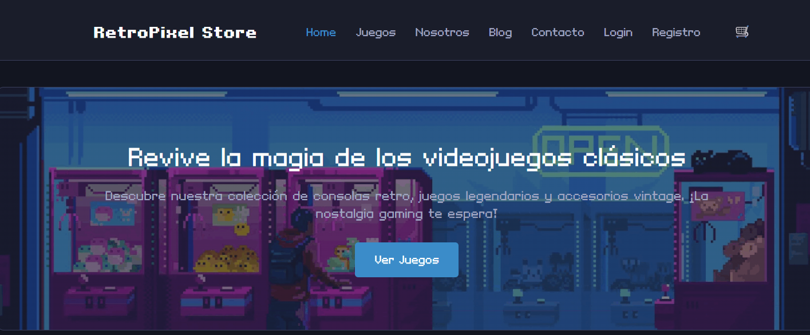

<h1 align="left">Hola 👋  soy Alejandro</h1>

 

<h2>Sobre mí </h2>
<!--Intro start-->

Estudiante de Ingeniería en Informática en Duoc UC. 
Conocimientos en Python, Java, Spring Boot, Kotlin, HTML, CSS, JavaScript y SQL.

<!--Intro end-->

 

<h2 >Tecnologías conocidas 👨🏻‍💻</h2>

  
  
  
  
  
  
  

 

<h2>Algunos proyectos 👨🏻‍💻</h2>

  
   
  
   
  <b>Retropixel Store</b> 
  Proyecto básico de tienda web hecho con HTML, CSS y JavaScript.

<h2>GitHub</h2>

<table align="left">
<tr border="none">
<td width="60%" align="center">
  
</td>
<td width="40%" align="center">
  
</td>
</tr>
</table>

  

